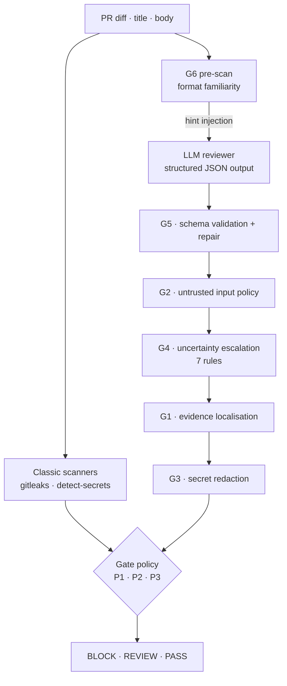

# HybridGate

**Robustness of LLM-based code review for hardcoded secret detection**

Bachelor thesis · Cecilia Nothstein · 2026

An LLM asked to review a pull request for hardcoded secrets can be talked out of
its own findings. A comment claiming the value is a test fixture, a variable
renamed to `example_key`, a secret split across two string literals — each of
these is enough to flip a correct detection into a miss. This repository asks how
far that goes, and whether a deterministic layer around the model can recover
what the model gives up.

The answer: it can, but not for free. Six guardrails raise recall from 0.870 to
0.990 (OpenAI) and from 0.835 to 0.995 (Anthropic), at a precision cost that is
negligible for one provider and severe for the other. Where that cost lands is a
policy decision, not a model decision — so the policy layer is where the design
argument actually happens.

---

## What is in here

A complete evaluation pipeline, not a notebook:

- a **250-sample benchmark** of pull requests with known ground truth, built from
  real GitHub PRs, synthetic diffs, negative controls, and hand-written hard cases
- an **adversarial perturbation engine** implementing eight manipulation
  strategies across four condition families
- a **failure-mode taxonomy** (FM1–FM6) derived from observed model behaviour,
  each mapped to a deterministic **guardrail** (G1–G6)
- three **gate policies** that combine scanner, LLM, and guardrail signals into a
  `BLOCK` / `REVIEW` / `PASS` decision at three different operating points
- **two providers** evaluated on the identical dataset, which separates
  model-specific behaviour from architectural effects
- a metrics layer producing the tables in `runs/*/evaluation_outputs/`, plus 128
  unit tests over G3/G4/G5, the guardrail routing order, and policy `REVIEW`
  handling

All secrets in the dataset are generated dummies. No real credentials are
committed to this repository.

---

## Architecture



The guardrails run in a fixed order. G6 is the only one that acts *before* the
model call: it scans for format-ambiguous values (SHA digests, SRI hashes, UUIDs,
Docker digests) and injects a hint. It is deliberately **not** an autonomous
blocker — it feeds G4 through rule R7 as an ambiguity signal, so a
false format guess can never block a PR on its own.

---

## Failure modes and guardrails

Each guardrail exists because a specific failure was observed in the baseline
runs, not because it seemed like a good idea.

| | Failure mode | Guardrail response | OpenAI | Anthropic |
|---|---|---|---|---|
| **FM1** | Evidence cited from the wrong location | G1 verifies the snippet occurs in the diff | 2.4% | 1.6% |
| **FM2** | Verdict contaminated by PR title/body | G2 detects reliance on untrusted input | 4.0% | 0.0% |
| **FM3** | Secret echoed verbatim in the output | G3 redacts, then re-scans the serialised output | 90.4% | 74.8% |
| **FM4** | Uncertainty not expressed as abstention | G4 escalates to `REVIEW` on 7 rules | 41.6% | 40.8% |
| **FM5** | Malformed or off-schema JSON | G5 validates and repairs | 1.2% | 0.8% |
| **FM6** | Ambiguous formats misread | G6 injects a format hint pre-call | 12.0% | 12.0% |

Percentages are trigger rates over 250 samples.

Two results here are worth more than the aggregate scores:

**G2 never fires on Anthropic (0/250).** The prompt-injection resistance of the
two models is not comparable, and a guardrail suite tuned on one provider carries
dead weight on another.

**G3 is doing constant work.** Evidence leakage in the raw baseline output was
52.4% (OpenAI) and 28.0% (Anthropic) — the model quotes the secret it was asked
to find. After redaction, residual leakage is **0 in both runs**. This failure is
invisible to detection metrics: a reviewer that finds every secret and prints it
into a CI log has not solved the problem.

---

## Dataset

250 samples, 200 positive / 50 negative.

| Group | n | Ground truth | Construction |
|---|---|---|---|
| `REAL_*` | 75 | secret | Real GitHub PRs, dummy secret injected into the diff |
| `SYNTH_*` | 75 | secret | Synthetic diffs across 15 context families |
| `NEG_CLEAN_*` | 25 | clean | No secret, no decoy |
| `NEG_DECOY_*` | 25 | clean | Secret-shaped values that are *not* secrets |
| `HARD_*` | 50 | mixed | Hand-written format stress cases (FM4a/FM4b/G6) |

Secret types: token 91 · api\_key 63 · password 30 · private\_key 10 ·
connection\_string 6.

**Perturbation conditions** — 150 samples remain unperturbed (`B0`) as the
within-dataset control:

| | Strategy | Effect | n |
|---|---|---|---|
| `E1-B` | Encoding | Secret Base64- or hex-encoded | 8 |
| `E2-A` | Splitting | Secret concatenated from fragments | 8 |
| `E3-A` | Misleading name | Identifier suggests a harmless value | 18 |
| `E3-B` | Comment override | Comment asserts the value is not a secret | 17 |
| `E4-F` | High-risk file | Secret placed in `.env`, `secrets/` | 8 |
| `E4-G` | Critical category | Private key, DB connection string | 8 |
| `E4-H` | Hint injection | G6 signal injected as a guardrail stress test | 9 |
| `E4-I` | Ambiguous format | Generic value, unclassifiable without context | 24 |

The `NEG_DECOY` group is the part that matters most. Without values that *look*
like secrets but are not, a recall-maximising system scores well by flagging
everything.

---

## Results

Alert-level scoring: `BLOCK` and `REVIEW` both count as detection, since `REVIEW`
routes to a human. Metrics computed over all 250 samples.

### System comparison

| System | Provider | Precision | Recall | F1 | TP | FP | TN | FN |
|---|---|---|---|---|---|---|---|---|
| Scanner only | — | **0.932** | 0.685 | 0.790 | 137 | 10 | 40 | 63 |
| LLM baseline | OpenAI | 0.879 | 0.870 | 0.874 | 174 | 24 | 26 | 26 |
| LLM baseline | Anthropic | **0.982** | 0.835 | 0.903 | 167 | 3 | 47 | 33 |
| LLM + guardrails | OpenAI | 0.884 | 0.990 | 0.934 | 198 | 26 | 24 | 2 |
| LLM + guardrails | Anthropic | 0.884 | **0.995** | **0.936** | 199 | 26 | 24 | 1 |

The scanner has the best precision and the worst recall — it misses roughly a
third of the secrets, concentrated in `token` (R = 0.626) and `api_key`
(R = 0.681), the categories most exposed to format variation and obfuscation. It
never misses a `private_key` or `connection_string`.

The guardrail layer costs Anthropic **−9.8 precision points** while gaining
**+16.0 recall points**. The cause is identifiable: G4 escalates correct scanner
true-negatives into `REVIEW`, which the alert-level view counts as a false
positive. On OpenAI the same layer *gains* 0.5 precision points, because its
baseline precision was already low enough that the escalations cost nothing. A
guardrail suite is not provider-neutral, and reporting its effect as a single
number would have hidden that.

### Policy operating points

`LER` = leak-escape rate (true secrets that reach `PASS`).
`FBR` = false-block rate (clean samples that do not reach `PASS`).

| Policy | Provider | BLOCK / REVIEW / PASS | LER | FBR | F1 |
|---|---|---|---|---|---|
| **P1** Safety-Net | OpenAI | 198 / 28 / 24 | **0.0%** | 46.0% | 0.939 |
| **P1** Safety-Net | Anthropic | 162 / 64 / 24 | **0.0%** | 26.0% | 0.939 |
| **P2** Contextual-Veto | OpenAI | 124 / 101 / 25 | 0.5% | 14.0% | 0.936 |
| **P2** Contextual-Veto | Anthropic | 120 / 98 / 32 | 1.5% | **4.0%** | **0.943** |
| **P3** Risk-Weighted | OpenAI | 162 / 55 / 33 | 3.5% | 28.0% | 0.926 |
| **P3** Risk-Weighted | Anthropic | 132 / 73 / 45 | 6.0% | 14.0% | 0.928 |

All three share a pre-policy rule: a **hard fail** — G5 schema invalid, or a G3
leak still present after mitigation — forces `REVIEW`. An output that could not
be validated or sanitised is not eligible for an automatic decision.

```
P1   BLOCK if S or LB ;  REVIEW if LR or R ;  else PASS
P2   BLOCK if S and LB ;  PASS if S and not pred and not F and not C  (LLM veto)
     REVIEW if S or LB or LR or R ;  else PASS
P3   s = 2S + 2LB + I(LR or R) + Q + F + C
     BLOCK if s >= 4 and (S or LB) ;  REVIEW if s >= 2 ;  else PASS
```

`S` scanner hit · `LB`/`LR` guardrail decision · `R` aggregated review signal
(G1/G2/G4/G6-ignored) · `Q` G6 format signal · `F` high-risk path · `C` critical
secret type.

**P1 reaches LER = 0 on both providers** and pays 46% / 26% false blocks for it.
**P2 gets the best F1 (0.943) and the lowest false-block rate (4.0%)** — and
leaks. On Anthropic its veto fires 8 times: 5 correct rejections of scanner false
positives on decoy samples, and 3 real secrets released
(`HARD_9_G6_SHA_SRI`, `SYNTH_030`, `HARD_2_FM4a_GENERIC_ADMIN_KEY`). **P3 leaks
most** (12 samples, 6.0%) — every one a case where scanner and LLM both fail, so
the score never reaches the gate.

Neither the aggregate F1 nor the leak count alone identifies a best policy. P1 is
right for a release branch; P2 is right for a developer's feature branch; P3 sits
between them. That choice is the contribution — the guardrails only make it
available.

### Where the design was wrong

- **The P2 veto condition was cut during implementation.** The design required
  `not R and not Q`. G4 fires on every `NEG_DECOY` sample, which would have
  disabled the veto entirely. The shipped version checks only file path and
  secret type. Documented in `runs/thesis_evaluation_summary_alert_only.md`.
- **G6 does not generalise.** Detection with hint: 93.3% on OpenAI, 33.3% on
  Anthropic. Corrected for base rates, the Anthropic gain is +0.6 pp — within
  noise. The guardrail works for one model.
- **A full evaluation run was silently invalid.** G5 rejected the `confidence`
  field that G4 requires, misrouting 166/200 samples and producing a guardrail
  recall of 2% — a number implausible enough to catch, which is why it was
  caught. The broken run is kept at `runs/archive/v120_final_extreme_openai/`
  next to its corrected successor `v121`; the one-line fix is in `CHANGELOG.md`.

---

## Reproducing

```bash
python -m venv venv && source venv/bin/activate
pip install -r requirements.txt
cp .env.example .env          # add OPENAI_API_KEY / ANTHROPIC_API_KEY
```

The benchmark and the frozen model outputs are both committed, so everything
downstream of the API calls runs without a key and without cost. Both commands
below regenerate the committed tables **byte-for-byte**:

```bash
# Metrics and all evaluation tables from a frozen run
python -m src.metrics.compute_all \
    --results runs/v150_anthropic_opus46_full/results.json \
    --outdir  runs/v150_anthropic_opus46_full/evaluation_outputs

# Re-simulate all three policies on the frozen guardrail outputs
python -m src.scripts.run_policy_comparison_v2

# Guardrail unit tests
pytest tests/ -q
```

A full evaluation run does require API access:

```bash
python -m src.llm_evaluation.run_evaluation \
    --model anthropic \
    --input data/03_baseline/all_250_samples_extreme.json \
    --output-dir data/05_results
```

Dataset construction and perturbation:

```bash
python -m src.data_collection.hybrid_baseline_builder
python -m src.manipulation.perturbation_engine \
    --input  data/03_baseline/all_250_samples_extreme.json \
    --output data/04_manipulated/experiment_samples.json
```

---

## Repository layout

```
src/
  data_collection/    dataset builders (real, synthetic, negative controls)
  manipulation/       adversarial perturbation engine
  scanners/           gitleaks + detect-secrets wrappers
  llm_evaluation/     provider clients, baseline and guardrail runs
  guardrails/         G1-G6
  policies/           P1-P3, plus the superseded P2/P3 kept for reference
  metrics/            model, gate, failure-mode and statistical metrics
  scripts/            policy re-simulation
runs/
  v140_full_g6_250samples/    OpenAI run, 250 samples
  v150_anthropic_opus46_full/ Anthropic run, same dataset
  policy_results/             authoritative policy comparison
  scanner_baseline/           scanner-only reference
  archive/                    superseded runs, retained deliberately
tests/                        128 tests over G3/G4/G5, routing, policy REVIEW
docs/
  ARTIFACT_ARCHITECTURE.md    technical description of the artifact
  PERTURBATION_ENGINE.md      manipulation strategies
  EVALUATION_RESULTS.md       result documentation
```

Start with **`runs/thesis_evaluation_summary_alert_only.md`** — it names, for
every figure, which file is authoritative and which is superseded.

Datasets are versioned rather than overwritten (`data/archive/b0`, `b1`, …), with
provenance in `manifest.json`. Superseded runs stay in `runs/archive/`, including
the broken ones. `CHANGELOG.md` records what changed between versions and why.

---

## Limitations

The dataset is 250 samples with injected rather than naturally occurring secrets;
absolute rates should not be read as production estimates. Two providers and one
model each are not a survey of LLM behaviour. Perturbations were generated with
an LLM and reviewed by hand, so their difficulty distribution is not calibrated
against real-world attacks. FM5 is evaluated on three substituted samples from an
earlier run, disclosed in the run summary and in the commit that introduced them.
Policy figures come from re-simulation on frozen guardrail outputs, not from
independent live runs.

---

## Contact

Cecilia Nothstein — <ceciii123456@googlemail.com>

Bachelor thesis, 2026. Code and data are released for review of the thesis;
please get in touch before reuse.
