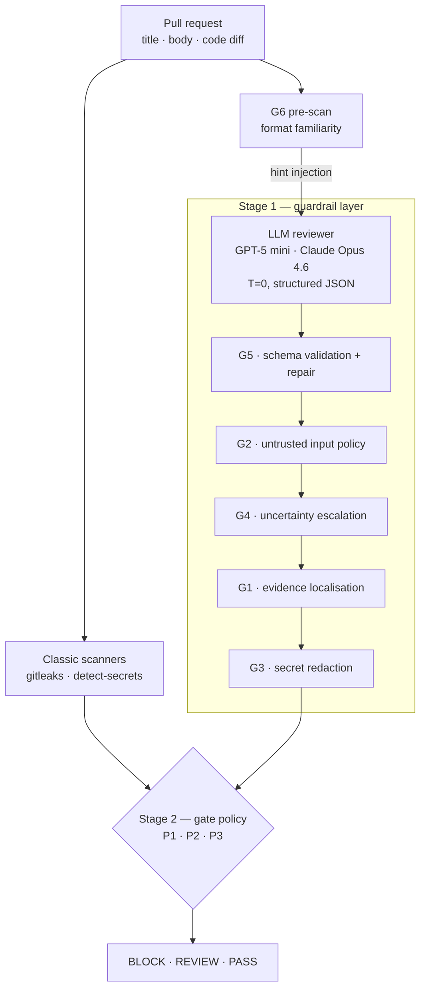

# HybridGate

**A guardrail-hardened hybrid pre-merge gate for detecting hardcoded secrets in pull requests**

Bachelor thesis · Cecilia Nothstein · DHBW Stuttgart, Business Information Systems · in cooperation with Mercedes-Benz Group AG · submitted 11 May 2026

Secret scanners miss roughly a third of hardcoded credentials, because a value's
sensitivity comes from how it is used, not from how it looks. An LLM reviewer can
read that context — and brings six failure modes of its own. This repository is
the artifact of a Design Science Research thesis asking where those failure modes
actually limit an LLM reviewer, and how far a deterministic layer around it can
make one safe enough for a DevSecOps pre-merge gate.

> **RQ** — What limits emerge when LLM-assisted code review is used to detect
> hardcoded secrets in pull requests, and to what extent can they be secured for
> operational DevSecOps use?
>
> **SQ1** Which failure modes occur? · **SQ2** How far do guardrails reduce them? ·
> **SQ3** What follows for practical deployment?

The short answer: the limit is not detection ability but the **reliability of
finding production**. Guardrails raise operational recall from 0.870 to 0.990
(OpenAI) and 0.835 to 0.995 (Anthropic) and remove 100% of observed secret
leakage from the model's own output — but a large part of that gain is escalation
to human review, not better classification. An unhardened LLM reviewer is not a
replacement for a classic scanner. It is a context-sensitive addition inside a
controlled architecture.

---

## Two stages



**Stage 1** hardens the LLM reviewer against six failure modes. **Stage 2** merges
the cleaned output with the scanner signal into a deterministic gate decision —
no second model call. The two stages are independently configurable, which is the
central design claim: technical detection quality and organisational risk appetite
are separate concerns.

G6 is the only guardrail that runs *before* the model call. Format-driven
misjudgements are formed during inference, so a purely downstream check could
detect them but no longer correct them. G6 is deliberately **not** an autonomous
blocker — it feeds G4 through rule R7 as an ambiguity signal.

---

## Where the failure modes come from

They are not invented, and not read off the runs. They come from a systematic
literature review (vom Brocke et al. for search, Webster & Watson for synthesis):

```
614 hits (IEEE Xplore · ACM DL · SpringerLink · Google Scholar · arXiv, 2023–2026)
 → 435 after deduplication
 → 123 after title/abstract screening
 →  67 full texts included  +12 via backward/forward snowballing
 →  79 primary studies → 17 failure-mode clusters
 →   6 evaluation failure modes
```

The reduction from 17 to 6 uses Hevner's three DSR requirements as explicit
selection criteria — problem relevance, artifact addressability, evaluability —
documented per cluster including every exclusion. The resulting set was then
validated against the **OWASP Top 10 for LLM Applications 2025**: all six map onto
OWASP risk classes, which grounds the taxonomy in a practice reference independent
of the literature corpus.

The corpus itself justifies the work: only **4 of 79 studies** (5.1%) address
secret detection as their primary task, while 44 (55.7%) address general
vulnerability detection. Vulnerability detection reasons over abstract weakness
classes; secret detection needs character-sequence-level, context-sensitive
judgement. That transfer is nowhere systematically demonstrated.

Four mitigation principles were synthesised from the same corpus — *Evidence and
Verifiability*, *Context Governance*, *Output Hardening and Schema Validation*,
*Uncertainty-Aware Evaluation* — and each guardrail derives from one of them.

| | Failure mode | Guardrail | Mechanism | OpenAI | Anthropic |
|---|---|---|---|---|---|
| **FM1** | Evidence and localization failure | G1 | TF-IDF-weighted match of snippet against the diff hunk | 2.4% | 1.6% |
| **FM2** | Untrusted-input influence | G2 | Detects exculpatory claims in PR title/body | 4.0% | 0.0% |
| **FM3** | Secret leakage in output | G3 | Regex + taint tracking + entropy filter (4.0 bit/char), then redaction | 90.4% | 74.8% |
| **FM4** | Uncertainty miscalibration | G4 | 13 uncertainty flags, 7 hard rules → escalate to REVIEW | 41.6% | 40.8% |
| **FM5** | Schema and output failure | G5 | Deterministic validation against the output schema, with repair | 1.2% | 0.8% |
| **FM6** | Format-familiarity misdirection | G6 | Pre-call hint injection for UUID / SHA-256 / digest formats | 12.0% | 12.0% |

Trigger rates over 250 samples. Two of them matter more than the aggregate scores:

**G2 never fires on Anthropic (0/250).** Prompt-injection susceptibility is not
comparable between the two providers; a guardrail suite tuned on one carries dead
weight on the other.

**G3 works constantly.** Raw baseline output reproduced the secret in cleartext in
52.4% (OpenAI) and 28.0% (Anthropic) of samples. After redaction: **0 in both
runs**. Detection metrics are blind to this — a reviewer that finds every secret
and prints it into a CI log has not solved the problem.

---

## Benchmark dataset

250 samples, 200 positive / 50 negative. Built as a **diagnostic instrument**, not
as a representative sample of production repositories: it exists to provoke and
measure the six failure modes under controlled conditions. Croft et al. report
label errors in ~71% of common vulnerability datasets, so ground truth here was
built manually against explicit criteria and peer-reviewed by two independent
master's students in computer science, with disagreements resolved by adjudication.

| Group | n | Ground truth | Construction |
|---|---|---|---|
| `REAL_*` | 75 | secret | Real public PR diffs, dummy secret injected (50 baseline + 25 perturbed) |
| `SYNTH_*` | 75 | secret | Generated diffs across 15 context families (50 baseline + 25 perturbed) |
| `NEG_CLEAN_*` | 25 | clean | Clean diffs, no secret candidate |
| `NEG_DECOY_*` | 25 | clean | Secret-shaped values that are not credentials |
| `HARD_*` | 50 | mixed | Hand-written format stress cases (FM4a, FM4b, G6) |

A value is labelled a secret only if it (a) is not reconstructable without the
original context, (b) opens a security-relevant access vector on disclosure, and
(c) is hardcoded as a literal in the diff. A finding counts as a true positive
only with correct file path **and** a line within ±3 lines of the annotation, or
an `evidence_snippet` that unambiguously contains the annotated range. Correct
binary classification without verifiable localisation is a *partial hit* and does
not count.

Secret types: token 91 · api\_key 63 · password 30 · private\_key 10 ·
connection\_string 6. Perturbation conditions (150 samples remain unperturbed as
the within-dataset control): `E1-B` encoding 8 · `E2-A` splitting 8 · `E3-A`
misleading name 18 · `E3-B` comment override 17 · `E4-F` high-risk file 8 ·
`E4-G` critical category 8 · `E4-H` hint injection 9 · `E4-I` ambiguous format 24.

The `NEG_DECOY` group carries the most weight. Without values that *look* like
secrets but are not, a recall-maximising system scores well by flagging everything.

---

## Results

Alert-level scoring: `BLOCK` and `REVIEW` both count as detection, since `REVIEW`
routes to a human. A secret counts as missed only when it passes the gate as
`PASS`. Accuracy is deliberately not reported — at an 80% positive rate, constant
positive classification would already score high.

Two domain metrics carry the interpretation, because the error costs are
asymmetric: an escaped secret can become a credential leak, a falsely blocked pull
request costs developer time. `LER` = leak-escape rate (FN / GT⁺), `FBR` =
false-block rate (FP / GT⁻).

### Baseline and guardrail effect

| System | Provider | Precision | Recall | F1 | TP | FP | TN | FN |
|---|---|---|---|---|---|---|---|---|
| Scanner only | — | **0.932** | 0.685 | 0.790 | 137 | 10 | 40 | 63 |
| LLM baseline | OpenAI | 0.879 | 0.870 | 0.874 | 174 | 24 | 26 | 26 |
| LLM baseline | Anthropic | **0.982** | 0.835 | 0.903 | 167 | 3 | 47 | 33 |
| LLM + guardrails | OpenAI | 0.884 | 0.990 | 0.934 | 198 | 26 | 24 | 2 |
| LLM + guardrails | Anthropic | 0.884 | **0.995** | **0.936** | 199 | 26 | 24 | 1 |

The scanner has the best precision and the worst recall. Its misses are
type-specific: `private_key` and `connection_string` are caught completely
(R = 1.000), `token` (0.626) and `api_key` (0.681) are not — exactly the types
that lack stable format signatures. Those 63 misses are what motivates an LLM
layer at all.

The guardrail layer costs Anthropic **−9.8 precision points** for **+16.0 recall
points**. The cause is identifiable: G4 escalates correct scanner true-negatives
into `REVIEW`, which alert-level scoring counts as false positives. On OpenAI the
same layer *gains* 0.5 precision points, because its baseline precision was
already low enough that the escalations cost nothing. A guardrail suite is not
provider-neutral, and a single averaged number would have hidden that.

### Gate policies

All three share a pre-policy fail-closed rule: a **hard fail** — G5 schema still
invalid after repair, or a G3 leak persisting after mitigation — forces `REVIEW`.
Output that could not be validated or sanitised is not eligible for an automatic
decision. Separating technical hard fails from epistemic review signals keeps G4's
uncertainty output from dominating the detection logic.

| Policy | Provider | BLOCK / REVIEW / PASS | LER | FBR | F1 |
|---|---|---|---|---|---|
| **P1** Safety-Net | OpenAI | 198 / 28 / 24 | **0.0%** | 46.0% | 0.939 |
| **P1** Safety-Net | Anthropic | 162 / 64 / 24 | **0.0%** | 26.0% | 0.939 |
| **P2** Contextual-Veto | OpenAI | 124 / 101 / 25 | 0.5% | 14.0% | 0.936 |
| **P2** Contextual-Veto | Anthropic | 120 / 98 / 32 | 1.5% | **4.0%** | **0.943** |
| **P3** Risk-Weighted | OpenAI | 162 / 55 / 33 | 3.5% | 28.0% | 0.926 |
| **P3** Risk-Weighted | Anthropic | 132 / 73 / 45 | 6.0% | 14.0% | 0.928 |

The F1 spread across all six configurations is **0.017**. F1 is therefore useless
for choosing a policy — the difference lives entirely in the error profile.

**P1** reaches LER = 0 on both providers and pays up to 46% false blocks for it.
**P2** achieves the best F1 and the lowest false-block rate — and leaks. On
Anthropic its veto fires 8 times: 5 correct rejections of scanner false positives
on decoy samples, 3 real secrets released (`HARD_9_G6_SHA_SRI`, `SYNTH_030`,
`HARD_2_FM4a_GENERIC_ADMIN_KEY`). **P3** leaks most (12 samples) — every one a
case where scanner and LLM both fail, so the score never reaches the gate. Its
separation is nonetheless real: 97.2% of the BLOCK band (σ ≥ 4) contains an actual
secret, against 26.1% in the PASS band (σ ≤ 1).

P1 fits a regulated release branch, P2 a high-throughput feature branch with
review capacity available, P3 an audit context where thresholds must be
recalibrated without touching the guardrail architecture. The choice is an
organisational one about error costs, not a technical optimisation.

### External plausibility check

The benchmark is built along the failure modes it measures, which risks
construction-artifact sensitivity: the effects could come from the dataset rather
than from the mitigations. To probe this, the pipeline was run against **30 public
merged pull requests** from open-source repositories (SuiteCRM, rancher, immich,
mastodon, envoy, keycloak, bitcoin, go-ethereum and others), selected by
stratified purposive sampling — 12 clear positives, 10 ambiguous cases, 8 negative
decoys.

| System | Precision | Recall | F1 |
|---|---|---|---|
| Scanner | 0.667 | 0.667 | 0.667 |
| LLM baseline (OpenAI) | 0.667 | 0.667 | 0.667 |
| LLM baseline (Anthropic) | **1.000** | 0.500 | 0.667 |
| LLM + guardrails (OpenAI) | 0.500 | **0.833** | 0.625 |
| LLM + guardrails (Anthropic) | 0.556 | **0.833** | 0.667 |

The directional finding holds: guardrails raise operational recall (+33.3 pp
Anthropic, +16.6 pp OpenAI), consistent in magnitude with the main evaluation.
But the check also produces a result that **contradicts** the main evaluation —
externally the raw LLM reviewer shows no advantage over the scanner at all
(Anthropic baseline recall 0.500 *below* the scanner's 0.667). The LLM's value
here appears only after guardrail hardening. That is a genuine limit on how far
the main benchmark's LLM advantage generalises, and it is reported rather than
smoothed over.

---

## Where implementation and thesis diverge

The thesis was submitted 11 May 2026; the code kept moving. Four places where the
written specification and this repository do not match:

- **G4 weighted uncertainty score** — Eq. 4.1 defines σ_u = Σ w_i·f_i with a
  threshold θ_u alongside the hard rules. The implementation has only the seven
  ordered rules ([`REVIEW_RULES`](src/guardrails/g4_uncertainty.py#L654));
  no weights, no threshold.
- **G4 flag set** — Appendix 4/6 lists 9 uncertainty flags; the implementation
  carries 13.
- **P2 veto condition** — Eq. 4.4 specifies `S ∧ ¬P̂ ∧ ¬R ∧ ¬F`. The
  implementation drops `¬R` and adds `¬C` (critical secret type). `¬R` was removed
  deliberately: G4 fires on every `NEG_DECOY` sample, which would have disabled
  the veto entirely.
- **P3 score** — Eq. 4.5 gives σ = 2S + 2LB + I(LR∨R) + F. The implementation adds
  the G6 format signal `Q` and the critical-secret-type term `C`.

All reported policy figures come from the implementation, re-simulated on the
frozen guardrail outputs — not from the formulas as printed in the thesis.

Two further design decisions did not survive contact with the data, and are worth
naming: **G6 does not generalise** (detection with hint: 93.3% OpenAI vs 33.3%
Anthropic — corrected for base rates the Anthropic gain is +0.6 pp, within noise),
and an entire evaluation run was **silently invalid** when G5 rejected the
`confidence` field that G4 requires, misrouting 166/200 samples and producing a
guardrail recall of 2%. The broken run is kept at
`runs/archive/v120_final_extreme_openai/` next to its corrected successor.

---

## Limitations

The dataset is semi-synthetic; 100 of 250 samples are stress cases constructed
along the very failure modes being measured. The external check addresses this
partially, not fully. The guardrail layer was evaluated as a bundle with all six
active — activation rates are diagnostic indicators, not causal effect
measurements, and no ablation study was run. The 200:50 positive ratio departs
from real base rates, so absolute false-positive rates do not transfer to
production. Policy weights and thresholds are conservative heuristics, not
statistically optimised. Two providers with one model each are not a survey of LLM
behaviour, and open-source or security-fine-tuned models were not included.
Latency, inference cost and human-in-the-loop review load were not measured. FM5
is evaluated on three samples substituted from an earlier run, disclosed in the
run summary and in the commit that introduced them. Results hold for hardcoded
secrets and do not generalise to other weakness classes.

---

## Reproducing

```bash
python -m venv venv && source venv/bin/activate
pip install -r requirements.txt
cp .env.example .env          # add OPENAI_API_KEY / ANTHROPIC_API_KEY
```

The benchmark and the frozen model outputs are both committed, so everything
downstream of the API calls runs without a key and without cost. Both commands
below regenerate the committed tables **byte-for-byte**:

```bash
# Metrics and all evaluation tables from a frozen run
python -m src.metrics.compute_all \
    --results runs/v150_anthropic_opus46_full/results.json \
    --outdir  runs/v150_anthropic_opus46_full/evaluation_outputs

# Re-simulate all three policies on the frozen guardrail outputs
python -m src.scripts.run_policy_comparison_v2

# Guardrail unit tests
pytest tests/ -q
```

A full evaluation run requires API access:

```bash
python -m src.llm_evaluation.run_evaluation \
    --model anthropic \
    --input data/03_baseline/all_250_samples_extreme.json \
    --output-dir data/05_results
```

---

## Repository layout

```
src/
  data_collection/    dataset builders (real, synthetic, negative controls)
  manipulation/       perturbation engine (E1–E4)
  scanners/           gitleaks + detect-secrets wrappers
  llm_evaluation/     provider clients, baseline and guardrail runs
  guardrails/         G1-G6
  policies/           P1-P3, plus the superseded P2/P3 kept for reference
  metrics/            model, gate, failure-mode (PRI) and statistical metrics
  scripts/            policy re-simulation
runs/
  v140_full_g6_250samples/    OpenAI run (GPT-5 mini), 250 samples
  v150_anthropic_opus46_full/ Anthropic run (Claude Opus 4.6), same dataset
  policy_results/             authoritative policy comparison
  scanner_baseline/           scanner-only reference
  archive/                    superseded runs, retained deliberately
scripts/
  plausibilitaetspruefung.py  collects the real PRs for the external check
tests/                        128 tests over G3/G4/G5, routing, policy REVIEW
docs/
  ARTIFACT_ARCHITECTURE.md    technical description of the artifact
  PERTURBATION_ENGINE.md      manipulation strategies
  SLR_FM_MetricsMapping.csv   literature-to-metric mapping from the SLR
```

Start with **`runs/thesis_evaluation_summary_alert_only.md`** — it names, for every
figure, which file is authoritative and which is superseded.

Datasets are versioned rather than overwritten (`data/archive/b0`, `b1`, …), with
provenance in `manifest.json`. Superseded runs stay in `runs/archive/`, including
the broken ones. `CHANGELOG.md` records what changed between versions and why.

All secrets in the dataset are generated dummies. No real credentials are
committed to this repository.

---

## Contact

Cecilia Nothstein — <ceciii123456@googlemail.com>

Bachelor thesis, DHBW Stuttgart, 2026. Code and data are released for review of
the thesis; please get in touch before reuse.
