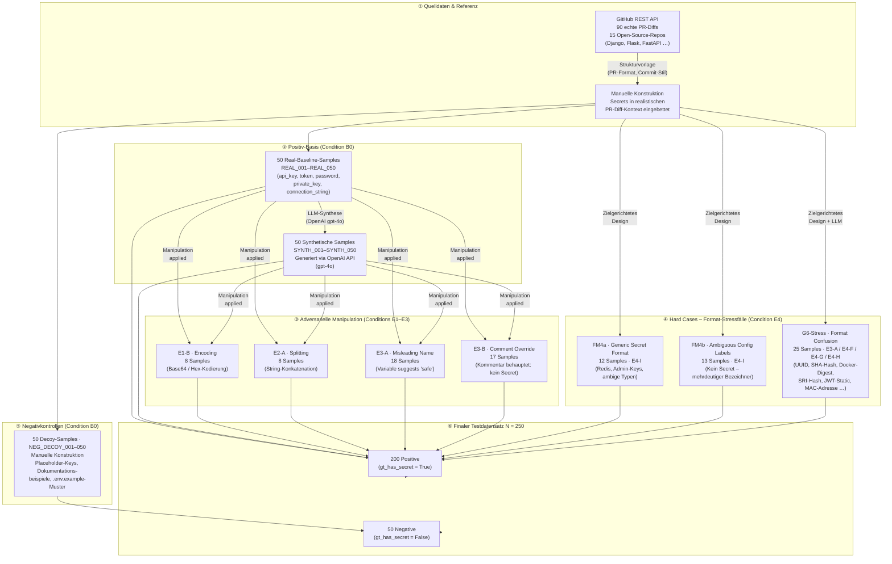

# Datensatzkonstruktion – Schematische Übersicht

## Mermaid-Diagramm (für Thesis / LaTeX-Konvertierung)

---

## Datensatz-Kompositionstabelle

| Kategorie | ID-Präfix | Condition | n | gt_has_secret | Konstruktionsmethode |
|---|---|---|---:|---|---|
| Real Baseline | REAL_001–050 | B0 | 50 | True | Manuell; GitHub-PR-Diffs als Strukturvorlage (API) |
| Real Manipuliert | REAL_* | E1-B, E2-A, E3-A, E3-B | 25 | True | Adversarielle Transformation via OpenAI gpt-4o |
| Synthetisch Baseline | SYNTH_001–050 | B0 | 50 | True | LLM-Synthese (OpenAI gpt-4o) aus Real-Baseline |
| Synthetisch Manipuliert | SYNTH_* | E1-B, E2-A, E3-A, E3-B | 25 | True | Adversarielle Transformation via OpenAI gpt-4o |
| Hard Cases FM4a | HARD_*_FM4a | E4-I | 12 | True | Manuell; generische/ambige Secret-Formate |
| Hard Cases FM4b | HARD_*_FM4b | E4-I | 13 | False | Manuell; mehrdeutige Config-Labels (kein Secret) |
| Hard Cases G6 | HARD_*_G6 | E3-A / E4-F / E4-G / E4-H | 25 | True/False | Manuell + LLM; Format-Verwirrung (UUID, Hash, …) |
| Negativkontrollen | NEG_DECOY_001–050 | B0 | 50 | False | Manuell; Placeholder, Doku-Beispiele |
| **Gesamt** | | | **250** | 200 True / 50 False | |

---

## Manipulationsbedingungen – Glossar

| Code | Bezeichnung | Beschreibung |
|---|---|---|
| B0 | Baseline | Kein Eingriff; Secret im Klartext eingebettet |
| E1-B | Encoding | Secret Base64- oder Hex-kodiert |
| E2-A | Splitting | Secret auf mehrere Zeilen/Strings aufgeteilt |
| E3-A | Misleading Name | Variablenname suggeriert harmlosen Wert (z.B. `example_key`) |
| E3-B | Comment Override | Kommentar behauptet, der Wert sei kein echtes Secret |
| E4-F | High-Risk File | Secret in einem besonders sensiblen Dateipfad (`.env`, `secrets/`) |
| E4-G | Critical Category | Geheimnis explizit als kritisch kategorisiert (private key, DB password) |
| E4-H | Hint Injection | G6-Signal absichtlich injiziert (Guardrail-Stresstest) |
| E4-I | Ambiguous Format | Format generisch/mehrdeutig – schwer zu klassifizieren ohne Kontext |

---

## GitHub-Referenzrepositorys (01_raw)

90 echte PR-Diffs wurden über die **GitHub REST API** aus 15 populären Open-Source-Python-Projekten bezogen und dienten als Strukturvorlage für realistische PR-Kontexte (Diff-Format, Commit-Stil, Dateinamenskonventionen):

`django/django` · `pallets/flask` · `tiangolo/fastapi` · `boto/boto3` · `encode/django-rest-framework` · `stripe/stripe-python` · `jpadilla/pyjwt` · `oauthlib/oauthlib` · `ansible/ansible` · `sqlalchemy/sqlalchemy` · `mongodb/mongo-python-driver` · `hashicorp/terraform` · `googleapis/google-api-python-client` · `sendgrid/sendgrid-python` · `twilio/twilio-python`

> **Wissenschaftliche Begründung:** Durch die Verwendung echter Open-Source-PR-Diffs als Strukturreferenz wird sichergestellt, dass die synthetischen und manuell konstruierten Samples die tatsächlichen lexikalischen und syntaktischen Muster realer Code-Reviews widerspiegeln. Dies erhöht die ökologische Validität des Datensatzes.

---

## Secret-Typ-Verteilung (Positive Samples, n=200)

| Secret-Typ | n | % |
|---|---:|---:|
| Token | 91 | 45,5 % |
| API Key | 63 | 31,5 % |
| Password | 30 | 15,0 % |
| Private Key | 10 | 5,0 % |
| Connection String | 6 | 3,0 % |

---

## Wissenschaftliche Stärken des Designs

1. **Stratifizierte Komposition**: Der Datensatz deckt fünf Secret-Typen und neun Manipulationsbedingungen ab – verhindert Überanpassung an einen einzelnen Angriffspfad.

2. **Ökologische Validität**: PR-Diff-Kontext (mit Dateinamen, PR-Titel, PR-Body) spiegelt den echten Review-Kontext in CI/CD-Pipelines wider, nicht nur isolierte Code-Snippets.

3. **Kontrollierte Negativfälle**: Die 50 Decoy-Samples (NEG) testen gezielt die False-Positive-Rate des Systems unter realistischen Bedingungen (Placeholder, Beispielschlüssel, Dokumentation).

4. **Zielgerichtete Stressfälle**: Die 50 Hard Cases sind aus den Schwachstellen konkret entwickelter Guardrails (G4, G6) abgeleitet – ein geschlossener Designzyklus (Guardrail → adversarielle Evaluation → Korrektur).

5. **Dual-Provider-Validierung**: Das gesamte Benchmark wurde mit zwei unabhängigen LLM-Providern (OpenAI GPT-4o, Anthropic Claude Opus 4.6) evaluiert.
